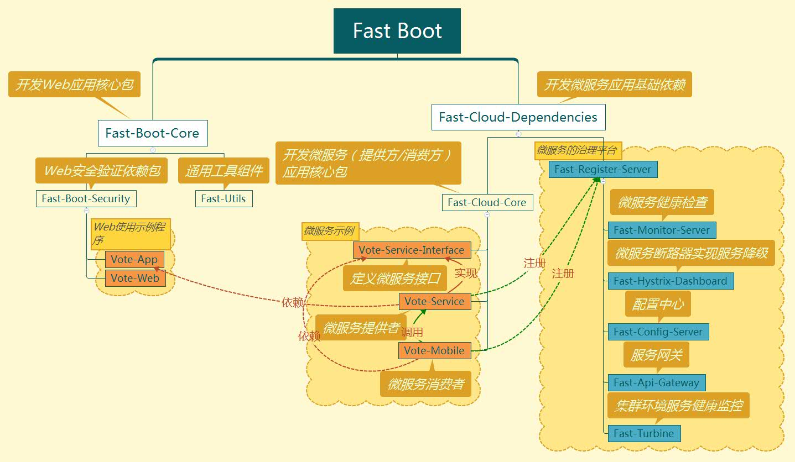
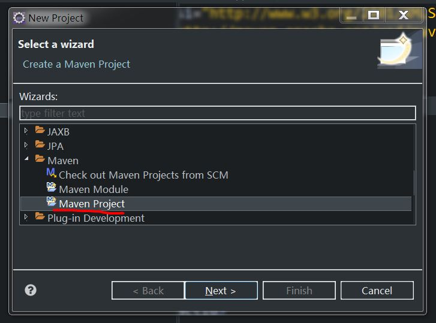
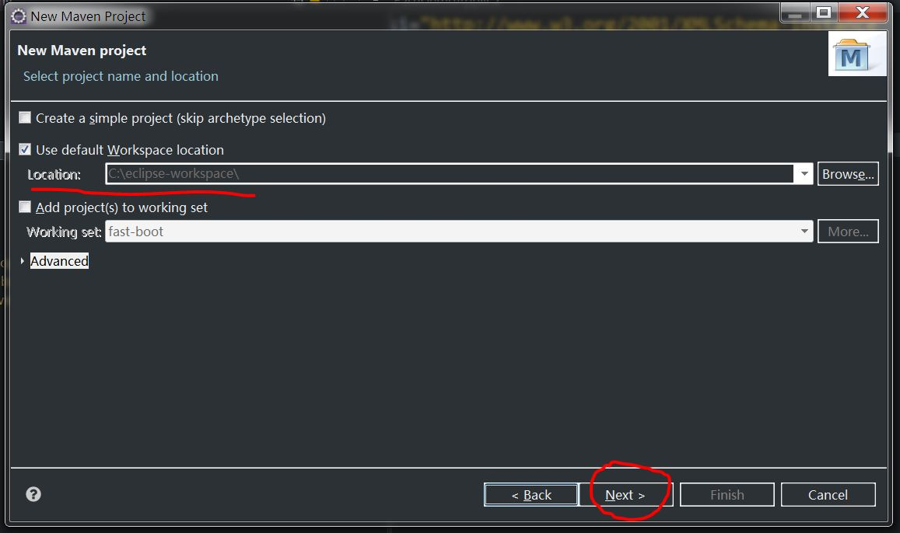
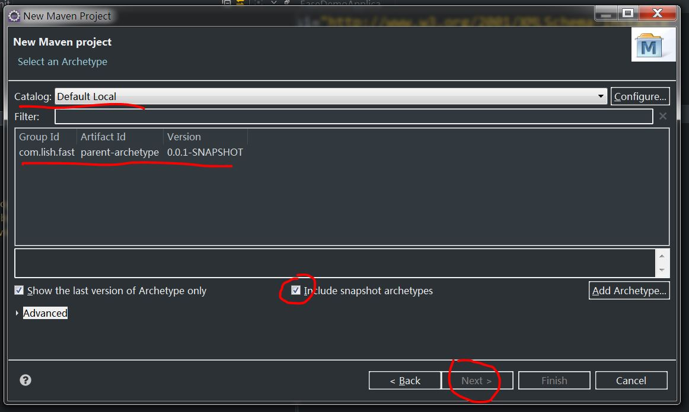
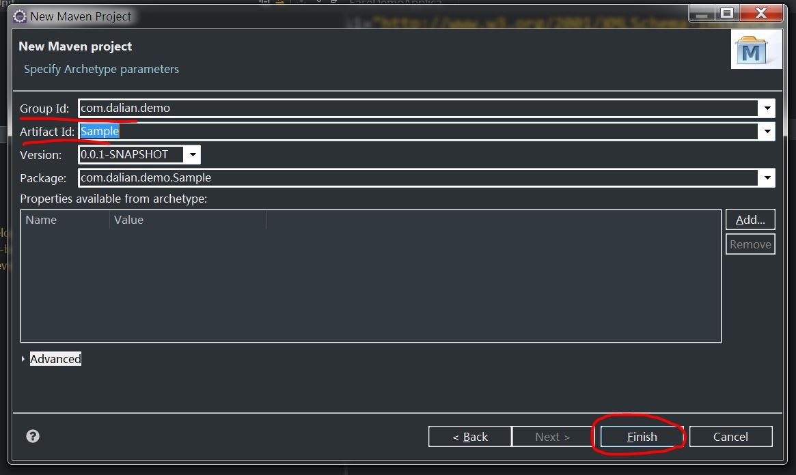

# Fast Boot

基于Spring Cloud实现微服务平台，支持服务注册、发现、健康检查、网关、断路器、负载均衡等功能。

## 使用的技术：
* Spring Boot
* Spring Cloud
* VUE
* Bootstrap
* Jquery
* Spring Boot Admin
* Swagger
## 使用的工具：
* maven
* git
* eclipse
* Mysql

## 工程结构说明：

## 模块说明：

### 1.fast-boot
    所有模块的父工程，全局通用配置。

### 2.fast-boot-core
    基于fast-boot开发非微服务时核心依赖工程

### 3.fast-boot-sample
    基于fast-boot开发的应用示例程序

### 4.fast-cloud-core
    开发基于fast-cloud微服务应用核心依赖工程

### 5.fast-cloud-dependencies
    开发微服务的依赖工程
### 6.fast-api-gateway
    微服务网关应用

### 7.fast-config-server
    微服务配置中心应用
### 8.fast-hystrix-server
    基于hystrix微服务健康检查
  
### 9.fast-monitor-server
    微服务监控应用
  
### 10.fast-register-server
    微服务注册和发现应用
### 11.fast-turbine
    基于turbine实现集群环境微服务健康检查应用

### 12.fast-boot-security:
    基于fast-boot开发的权限管理应用
#### 12.1.整合 Spring Security 提供一下功能：

* [x] 前后端分离

* [x] 权限认证 
 
* [x] 权限管理
 
* [x] 用户管理 

* [x] 角色管理 

* [x] 日志管理

#### 12.2.页面效果：

### 13.archetype
    生成工程骨架的工程
#### 13.1.fast-boot工程结构说明：
        基于fast-boot的应用一般分为两个模块：XXX-app和XXX-web，app模块为后台服务应用，web模块为前端页面工程。
#### 13.2.使用方法：
        1.将fast-boot工程根目录下的archetype-catalog.xml文件拷贝到本地maven的本地仓库的根目录下（一般C:\Users\${当前用户}\.m2目录），如果该目录已存在此文件则将文件内容添加到该文件即可。
        2.在archetype模块的target\generated-sources\archetype目录下执行，mvn install命令安装archetype。
        3.使用eclipse创建maven工程，具体过程如下图：
        * 创建一个maven工程，点击下一步
        
        * 选择一个工程保存目录，点击下一步
        
        * 点击Catalog选择Default Local，勾选Include snapshot archetypes，然后在窗口中间列表中的选择com.lish.fast并点击下一步
        
        * 填写Group Id（项目目录名），Artifact Id（应用名），点击下一步
        
