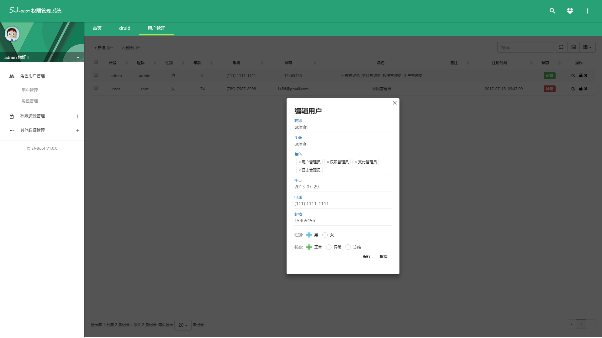
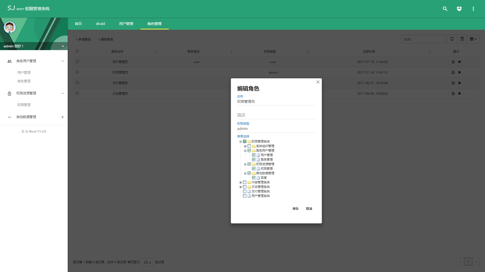
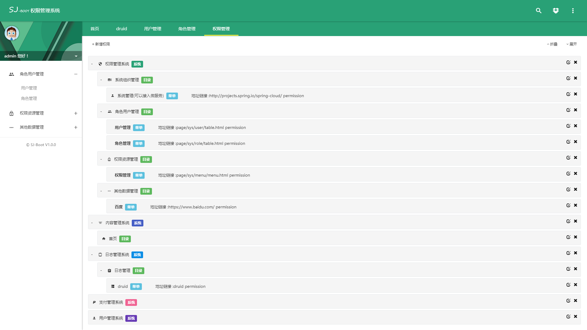
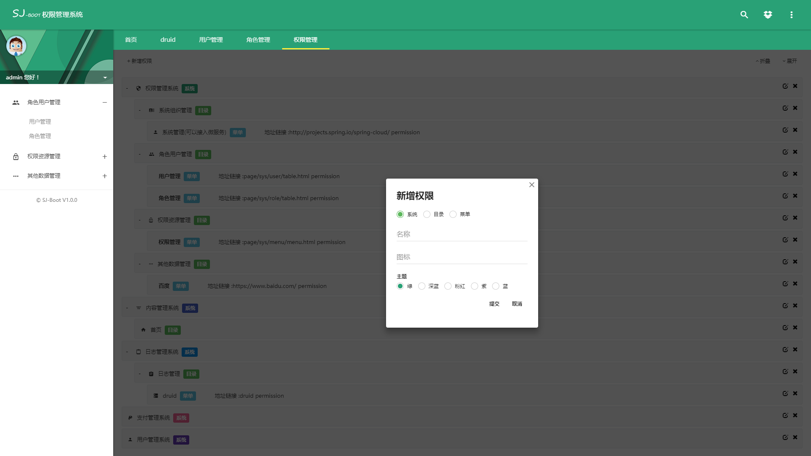
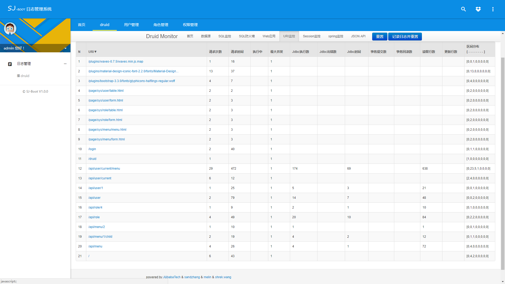
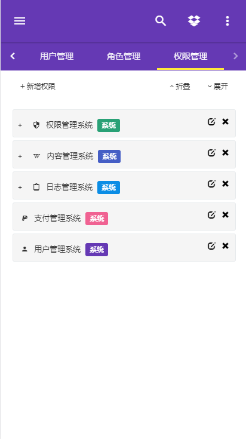
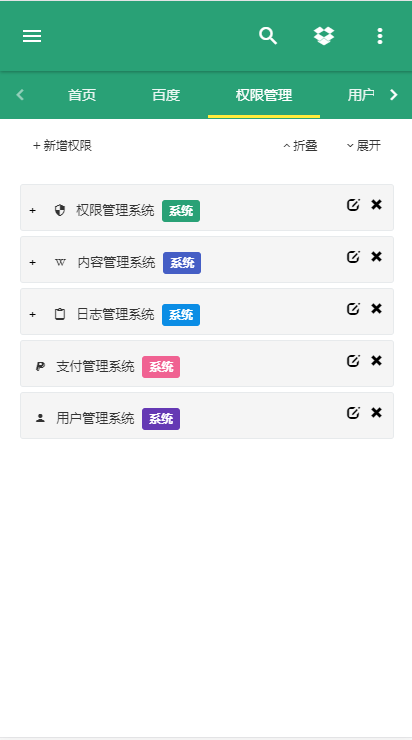
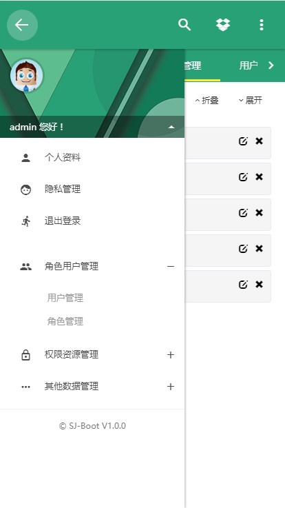
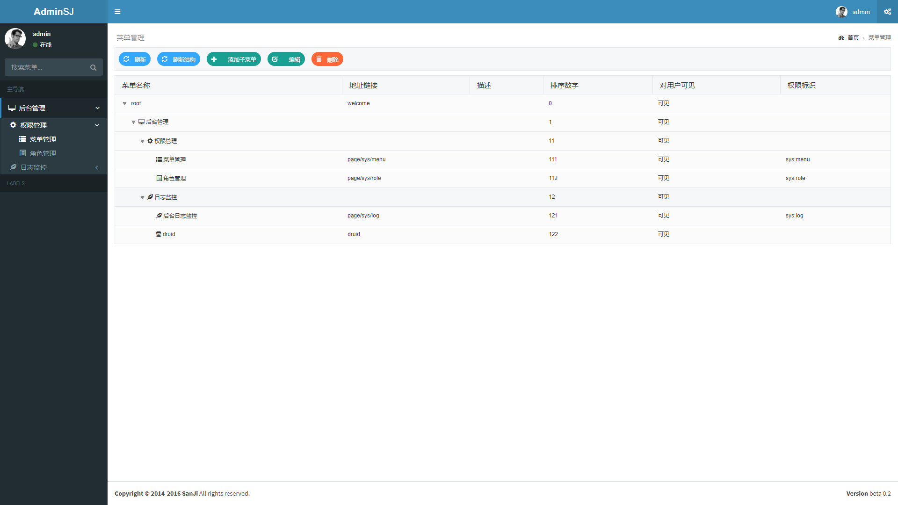
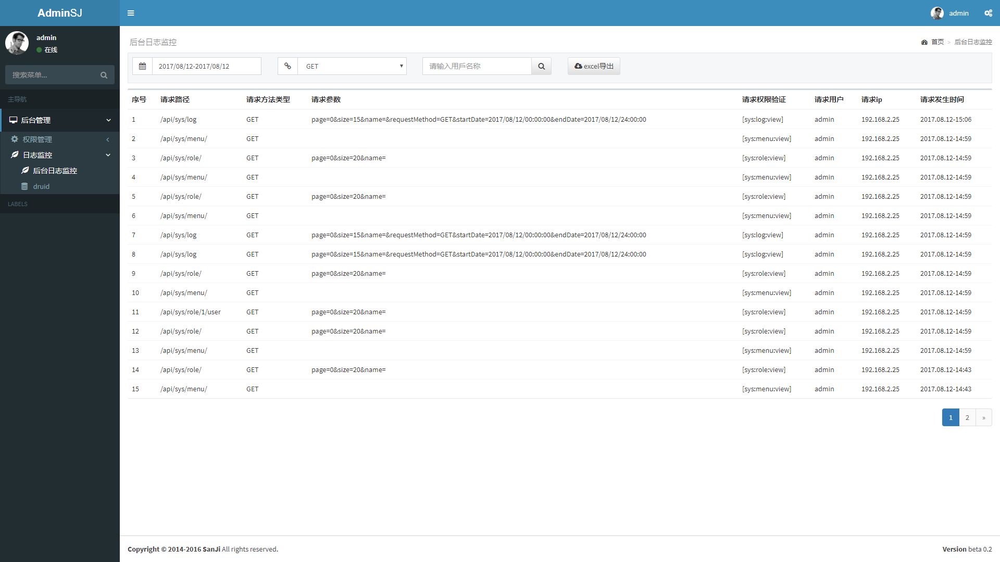

# SanJi Boot

基于Spring Boot 集成一些常用的功能，你只需要基于它做些简单的修改即可，下面是一个功能列表：

[MENU]

## SanJi Boot Security:

**整合 Spring Security 提供一下功能：**

* [x] 前后端分离

* [x] 权限认证 
 
* [x] 权限管理
 
* [x] 用户管理 

* [x] 角色管理 

* [x] 日志管理

### 页面效果：
**电脑端：**

**移动端：**

[查看详情](sanji-boot-security)

## SanJi Boot Shiro

**整合 Apache Shiro 提供一下功能：**

* [x] 权限认证 

* [x] 权限管理

* [x] 日志管理

* [ ] 用户管理 

### 页面效果：

[查看详情](sanji-boot-shiro)

## utils

一些小工具 后期会逐渐壮大

### 注意事项：
由于使用了一个自定义的常用功能包需要手动将 [bloom-common.zip](resources/lib/bloom-common.zip)解压后放在本地maven仓库的cn/sunxyz目录下

## share

分享一些优秀的类库,及上手demo

正在规划中......