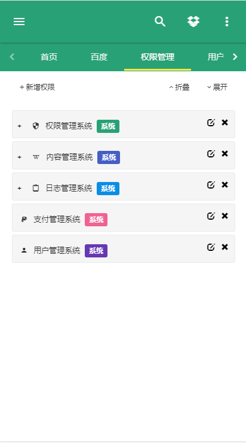

## Fast Boot Security:

### 项目说明：

项目基于Spring Boot，以Spring Boot 为起点，使用Spring MVC, Spring Data JPA,  Spring Security等框架。

前端页面基于 [zhengAdmin](https://github.com/shuzheng/zhengAdmin)

**提供一下功能：**

* [x] 权限认证 
 
* [x] 权限管理
 
* [x] 用户管理 

* [x] 角色管理 

* [x] 日志管理

* [x] 前后端分离

**后期改造升级：**

* [ ] 前端使用 Webpack+Vue cli + Vue + iviewui + axios

**为什么使用Spring Boot?**

关于为什么使用Spring Boot ,这里以一段代码进行演示：
```
@RestController
@SpringBootApplication
public class App{

    @GetMapping
    String home() {
        return "Hello World!";
    }

    public static void main(String[] args) {
        SpringApplication.run(App.class, args);
    }

}
```
Spring Boot 整合众多的主流技术框架提供了默认的配值可以让我们更加关注与代码的业务，提升开发速度，这里以一个Spring Data JPA的删除操作为例：
```
public interface MenuRepository extends JpaRepository<Menu, Long> {

}
```

```
@RestController
@RequestMapping("/api/menu")
public class MenuController {

    @Autowired
    private MenuRepository repository;

    @Transactional
    @DeleteMapping
    public Result<String> delete(@RequestBody Long[] ids) {
        Arrays.asList(ids).forEach(repository::delete);
        return ok();
    }
}
```
相比于以往的操作是否更加优雅，而这一切Spring Data JPA 都已为我们做好了。

使用Spring Boot 之后我们可以将配置减到最低,5分钟即可写一个简单的CRUD的Demo不在是空中楼阁(有没有心动?后面扩展给出了学习资料)。

安利了Spring Boot ,再安利一下Vue js

这里以Vue官网的demo为例：

```
<div id="app">
  {{ message }}
</div>
var app = new Vue({
  el: '#app',
  data: {
    message: 'Hello Vue!'
  }
})

```
Hello Vue!

其中的好处只有使用后才知道 哈哈>_< 


### 注意事项

运行项目之前先将 [sanji-boot-security.sql](sanji-boot-security.sql)导入

 **权限注解需要自己进行配置** 

### 项目结构
```
sanji-boot-security
├─java
│  ├─common 公共模块
│  │  ├─base curd的封装
│  │  └─utils 常用工具
│  │ 
│  ├─config 配置信息
│  │ 
│  ├─modules 功能模块
│  │  └─sys 权限模块
│  │ 
│  └─SanjiBootSecurityApplication 项目启动类
│  
└─resources 
   ├─static 第三方库、插件等静态资源
   │ ├─app 项目中自己写的css js img 等资源文件
   │ ├─page 页面
   │ └─plugins 第三方库、插件等静态资源
   │ 
   └─application.yml  项目配置文件
```

### 技术栈(技术选型)：

**后端:**

核心框架 ：Spring Boot 1.5.2.RELEASE

安全框架：Apache security

视图框架：Spring MVC

持久层框架：Spring Data JPA

数据库连接池：Alibaba Druid 1.0.20

日志管理：LogBack

**前端:**

主要使用的技术：

渐进式JavaScript 框架：VUE 2.2.0

弹窗框架： jquery-confirm

页面主体框架 ：zhengAdmin


### 页面效果：
**电脑端：**


**移动端：**





### 扩展

[zhengAdmin](https://github.com/shuzheng/zhengAdmin/blob/master/README.md)

[使用Vue](https://cn.vuejs.org/v2/guide/)

**[Spring Boot 学习资料](https://segmentfault.com/a/1190000008539153)**
