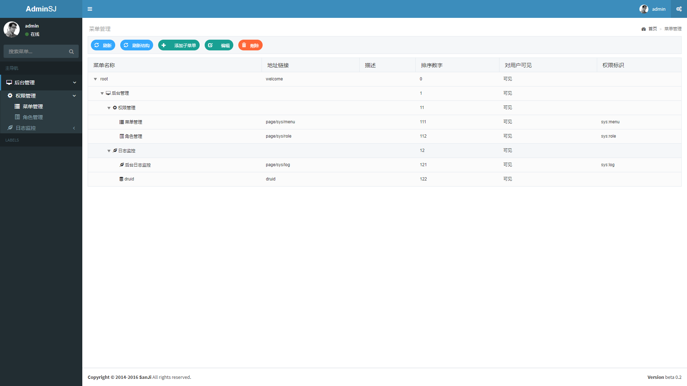

## SanJi Boot Shiro:
**整合 Apache Shiro 提供一下功能：**

* [x] 权限认证 

* [x] 权限管理

* [x] 日志管理

* [ ] 用户管理 

### 页面效果：

### 技术栈：
**后端：**

核心框架 ：Spring Boot 1.5.2.RELEASE

安全框架：Apache Shiro 1.2.5

视图框架：Spring MVC

持久层框架：JPA

数据库连接池：Alibaba Druid 1.0.20

日志管理：LogBack

工具类：easypoi 2.3.1 fastjson 1.2.23

**前端:**

主要使用的技术，许多的组件框架就不在列举：

CSS框架：Twitter Bootstrap 3

渐进式JavaScript 框架：VUE 2.2.0

弹窗框架： layUI 1.0.9_rls

页面样式框架 ：adminLTE 2.3.8